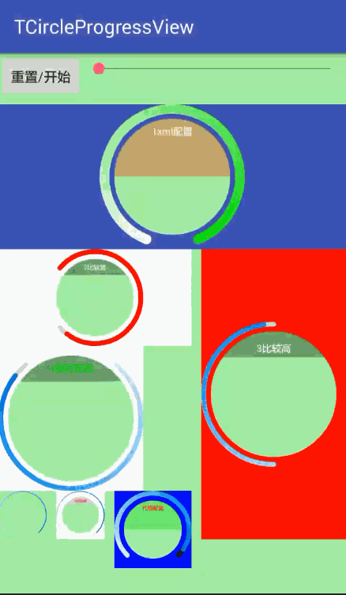

# TCircleProgressView
一个圆型进度条 仿支付宝人脸识别进度条 progressbar

# 效果



## 支持属性
#### TCircleProgressView

|         属性名          |                 属性说明           |     类型       |
| :------------------: | :-------------------------------: |:--------------:|
| tcpv_border_width  |           圆弧宽度        | dimension        |
|  tcpv_start_angle  |              圆弧开始角度              | integer        |
|  tcpv_blank_angle   |       圆弧空白角度                |   integer      |
|  tcpv_animation_duration   |               动画持续时间 单位秒            |   integer      |
|  tcpv_total_progress   |               总进度 |   integer    |
|tcpv_background_color| 背景色                   | color     |
|tcpv_arc_background_color  |           圆弧背景色                      |color    |
|tcpv_arc_start_color |      进度圆弧开始色                   |color    |
|tcpv_arc_end_color       |           进度圆弧结束色               |color    |
|tcpv_hint_background_color   |       半圆背景色                        |color   |
|tcpv_hint_text_color      |       字体颜色                     |color   |
|tcpv_hint_text_size      |       字体大小                     |dimension   |
|tcpv_hint_text      |       文字                     |string   |
|tcpv_hint_show      |       是否显示半圆                     |boolean   |
|tcpv_hint_semicircle_rate      |       半圆覆盖比率 0.1f - 1f                     |float   |

## 使用

- 添加到你项目的根build.gradle脚本代码中:
```
	allprojects {
		repositories {
			...
			maven { url 'https://jitpack.io' }
		}
	}
  ```

- 添加 dependency

  ```
	dependencies {
	        //compile 'com.github.comtu:TCircleProgressView:v1.0.1'
		implementation 'com.github.comtu:TCircleProgressView:v1.0.1'
	}
  ```

- 在布局文件中添加TCircleProgressView并设置相关自定义属性

```xml
 <com.tu.tcircleprogresslibrary.TCircleProgressView
            android:id="@+id/tcpv_demo_1"
            android:layout_width="match_parent"
            android:layout_height="150dp"
            android:layout_below="@+id/but"
            android:layout_marginTop="5dp"
            app:tcpv_animation_duration="1"
            app:tcpv_arc_background_color="@color/colorAccent"
            app:tcpv_arc_end_color="#00ff00"
            app:tcpv_arc_start_color="#fff"
            app:tcpv_background_color="@color/colorPrimary"
            app:tcpv_blank_angle="45"
            app:tcpv_border_width="10dp"
            app:tcpv_hint_background_color="#55ff0000"
            app:tcpv_hint_semicircle_rate="0.5"
            app:tcpv_hint_show="true"
            app:tcpv_hint_text="1xml配置"
            app:tcpv_hint_text_color="#ffffff"
            app:tcpv_hint_text_size="10dp"
            app:tcpv_start_angle="90"
            app:tcpv_total_progress="100"/>

```

- 代码设置

``` java

mTCPV_Demo_7.setProgress(10); 
mTCPV_Demo_7.setProgressByAnimation(0, 100);

mTCPV_Demo_7.setText("代码配置");
mTCPV_Demo_7.setBorderWidth(10f);//设置圆弧宽度
mTCPV_Demo_7.setStartAngle(90f, 90f);//设置圆弧起始的角度位置以及空白区域角度
mTCPV_Demo_7.setAnimationDuration(3000);//设置动画执行时间
mTCPV_Demo_7.setTotalProgress(100);//设置总进度
mTCPV_Demo_7.setGradualColors( new int[] { //设置进度渐变值
        Color.parseColor("#d3effe"),
        Color.parseColor("#cdeafb"),
        Color.parseColor("#94d3fa"),
        Color.parseColor("#61b9f5"),
        Color.parseColor("#2ba2f9"),
        Color.parseColor("#0b8eec"),
        Color.parseColor("#0179cf"),
        Color.parseColor("#0060a2")
});//渐变进度条颜色
mTCPV_Demo_7.setBackgroundColor(Color.parseColor("#0000ff"));//设置背景色
mTCPV_Demo_7.setArcBackgroundColor(Color.parseColor("#000000"));//设置圆弧背景色
mTCPV_Demo_7.setHintBackgroundColor(Color.parseColor("#5500FF00"));//设置圆弧背景色
mTCPV_Demo_7.setHintTextColor(Color.parseColor("#ff0000"));//设置文字颜色
mTCPV_Demo_7.setIsShowHint(true);//显示半圆与文字
mTCPV_Demo_7.setSemicircleRate(0.5f);//半圆覆盖比率

```

## License

```
MIT License

Copyright (c) 2018 comtu

Permission is hereby granted, free of charge, to any person obtaining a copy
of this software and associated documentation files (the "Software"), to deal
in the Software without restriction, including without limitation the rights
to use, copy, modify, merge, publish, distribute, sublicense, and/or sell
copies of the Software, and to permit persons to whom the Software is
furnished to do so, subject to the following conditions:

The above copyright notice and this permission notice shall be included in all
copies or substantial portions of the Software.

THE SOFTWARE IS PROVIDED "AS IS", WITHOUT WARRANTY OF ANY KIND, EXPRESS OR
IMPLIED, INCLUDING BUT NOT LIMITED TO THE WARRANTIES OF MERCHANTABILITY,
FITNESS FOR A PARTICULAR PURPOSE AND NONINFRINGEMENT. IN NO EVENT SHALL THE
AUTHORS OR COPYRIGHT HOLDERS BE LIABLE FOR ANY CLAIM, DAMAGES OR OTHER
LIABILITY, WHETHER IN AN ACTION OF CONTRACT, TORT OR OTHERWISE, ARISING FROM,
OUT OF OR IN CONNECTION WITH THE SOFTWARE OR THE USE OR OTHER DEALINGS IN THE
SOFTWARE.
```


